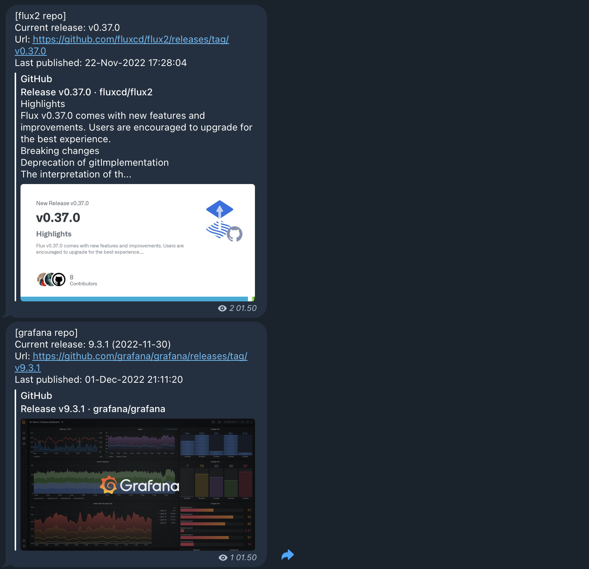

## Repo Watcher Operator

1. Fill in the manifest value for which repo you want to see the latest release from.
    ```yaml
    apiVersion: v1
    kind: Secret
    metadata:
      name: repo-watcher-secret
      namespace: repo-watcher
    type: Opaque
    data:
      GITHUB_PERSONAL_ACCESS_TOKEN: <base64>
      PROVIDER: <base64>
      TELEGRAM_ID: <base64>
      TELEGRAM_TOKEN: <base64>

    ---
    apiVersion: repo.muhammad-asn.example.com/v1alpha1
    kind: RepoWatcher
    metadata:
      labels:
        app.kubernetes.io/name: repowatcher
        app.kubernetes.io/instance: repowatcher-sample
        app.kubernetes.io/part-of: repo-watcher-operator
        app.kubernetes.io/managed-by: kustomize
        app.kubernetes.io/created-by: repo-watcher-operator
      name: repowatcher
    spec:
      image: docker.io/nuga99/repo-watcher:latest
      schedule: "*/5 * * * *"
      secret_ref:
        name: repo-watcher-secret
      repo_to_watch:
        - https://github.com/fluxcd/flux2
        - https://github.com/grafana/grafana
        - https://github.com/microsoft/vscode
    ```

2. How to run
    ```bash
    cd repo-watcher-operator
    make deploy
    kubectl apply -f repowatcher.yml
    ```

3. Notification
   
   Current notifaction provider is for Telegram only.
   